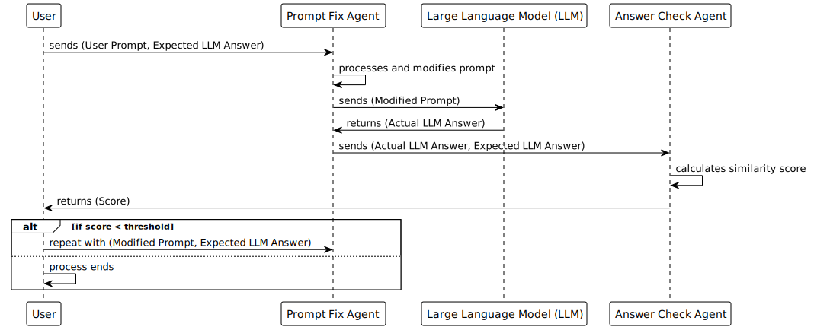

# Prompt Fix AGI


Prompt Fix AGI is an automatic prompt optimization tool designed to refine user prompts, enabling Large Language Models (LLMs) to provide more accurate and detailed responses. It takes user prompts and the expected LLM responses as inputs, and automatically adjusts the user prompts based on this information. Through this process, the tool clarifies and elaborates the prompts, ensuring that the LLM can respond in a manner that closely matches the expected answer.

## Process

The script works by an infinite loop that executes the following steps:

1. The user inputs the prompt and the expected LLM answer into the prompt fix agent.
2. The prompt fix agent returns the modified prompt.
3. The modified prompt is used to obtain an actual response from the LLM.
4. The actual response and the expected response are passed to the answer check agent, which assigns a score based on the similarity.
5. If the score exceeds a pre-set threshold, the process ends.
6. If the score is below the threshold, the modified prompt and the expected LLM answer are re-entered into the prompt fix agent, and the process repeats from step 2.
7. This loop continues until the score exceeds the threshold.
</br>



The `prompt_fix_agent()` function takes as input the user's prompt and the expected response from the LLM, and generates a modified prompt. The modified prompt identifies potential issues with the given prompt and corrects it to a more appropriate form.

The `answer_check_agent()` function takes as input the response obtained from the LLM and the expected response, and assigns a score based on the similarity of their contents. Specifically, it compares the similarity of the content and expressions in the responses and evaluates the degree of alignment with the expected response.

### Variables

The `minimum_point` is the minimum threshold point at which to stop processing.

The `retry` is the number of retries; if `None`, the number of retries is infinite. If `retry` is set, the loop will exit when the number is reached, even if the point does not exceed the minimum threshold point.

The `test_case` is a list of user prompt and expected response from LLM.

## Getting Started

1. Clone the repository via `https://github.com/mk668a/prompt-fix-agi.git` and `cd` into the cloned repository.
2. Install the required packages: `pip install -r requirements.txt`
3. Copy the .env.example file to .env: `cp .env.example .env`. This is where you will set the following variables.
4. Set your OpenAI API key in the OPENAI_API_KEY and OPENAI_API_MODEL variables.
5. Set `retry`, `minimum_point`, and `test_case` in `prompt-fix-agi.py`.
6. Run the script: `python prompt-fix-agi.py`

or

```shell
docker-compose up
```

## Examples

<details open>
  <summary>Pizza Example</summary>
In the following example, ideal_answer is a list of pizza ingredients. Since the question prompt is "what is pizza.", the LLM will not give an answer like ideal_answer. So, the prompt is automatically modified to get an answer similar to ideal_answer.

```
Start.

[prompt]
what is pizza.

[ideal_answer]

- 500g of strong flour
- 200ml of water
- 1 teaspoon of salt
- 1 teaspoon of dry yeast
- 2 tablespoons of olive oil.

------------------ loop 1 ------------------

[prompt_fix_agent fixed prompt]
what is pizza.
↓
Write down the necessary ingredients and measurements needed to make a basic pizza dough.

[llm answer]
To make a basic pizza dough, you will need the following ingredients and measurements:

- 2 ½ cups (300g) all-purpose flour
- 1 teaspoon (5g) granulated sugar
- 2 ¼ teaspoons (7g) active dry yeast
- 1 cup (240ml) warm water
- 2 tablespoons (30ml) olive oil
- 1 teaspoon (5g) salt

These measurements will yield approximately two medium-sized pizza crusts.

【point: 4.0】

------------------ loop 2 ------------------

[prompt_fix_agent fixed prompt]
Write down the necessary ingredients and measurements needed to make a basic pizza dough.
↓
Write down the necessary ingredients and their specific measurements needed to make a basic pizza dough. Be sure to include the quantities of each ingredient required.

[llm answer]
To make a basic pizza dough, you will need the following ingredients with their corresponding measurements:

- 2 ¼ cups (280 grams) of all-purpose flour
- 1 teaspoon of instant yeast
- ½ teaspoon of salt
- 1 teaspoon of sugar
- ¾ cup (180 milliliters) of warm water
- 2 tablespoons of olive oil

Please note that these measurements yield approximately two medium-sized pizza doughs.

【point: 6.0】

------------------ loop 3 ------------------

[prompt_fix_agent fixed prompt]
Write down the necessary ingredients and their specific measurements needed to make a basic pizza dough. Be sure to include the quantities of each ingredient required.
↓
List the specific quantities of each ingredient required to make a basic pizza dough. Include 500g of strong flour, 200ml of water, 1 teaspoon of salt, 1 teaspoon of dry yeast, and 2 tablespoons of olive oil.

[llm answer]
To make a basic pizza dough, you will need the following specific quantities of each ingredient:

- 500g of strong flour
- 200ml of water
- 1 teaspoon of salt
- 1 teaspoon of dry yeast
- 2 tablespoons of olive oil

【point: 10.0】

Done.

```

</details>

## About Contribution

Prompt Fix AGI was just an idea, but the current state is minimal.
There is much room for improvement, such as implementing a partial logic rather than LLM for evaluating responses, and having an axis for evaluating responses (e.g., sentence structure, content, and length, etc.).
Also, the prompt itself could be modified to further improve accuracy.
We look forward to your PRs.
